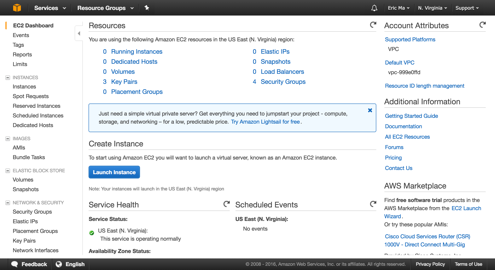
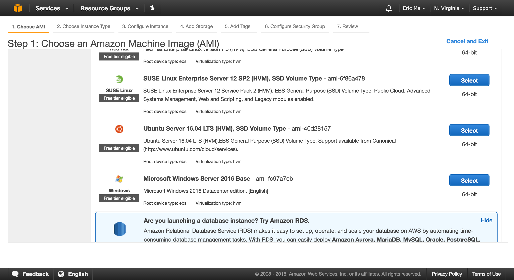
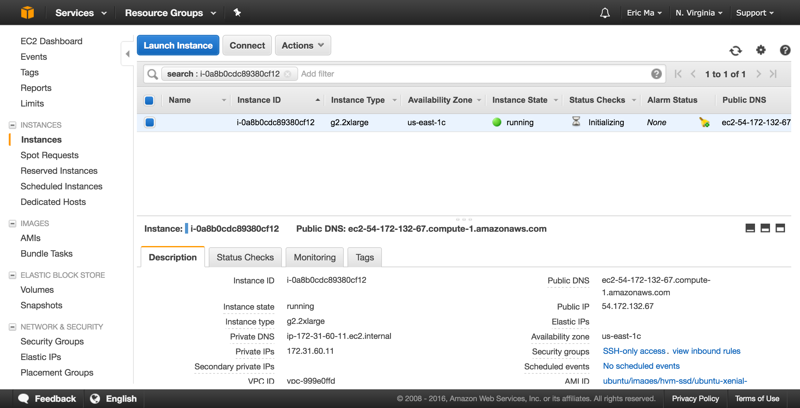
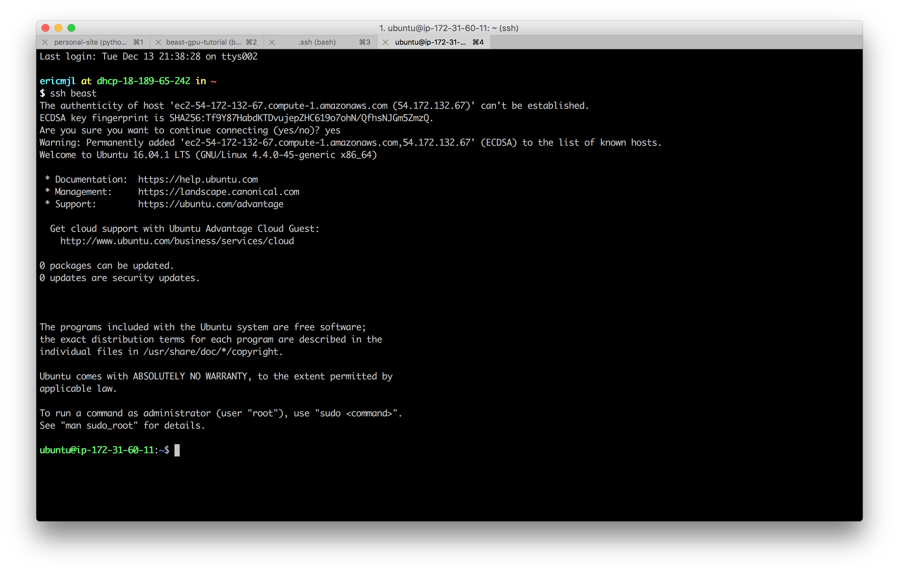

# Information

- Update 24 December 2016: Terry Jones has kindly shared [his tutorial][jones] written in 2015 for BEAST2. I plan to examine his tutorial and incorporate installation instructions for BEAST2 here.
- Page source on [GitHub](https://www.github.com/ericmjl/beast-gpu-tutorial). Contributions welcome via Pull Requests.
- More information on BEAST can found [here](http://beast.bio.ed.ac.uk).
- I'm assuming you have money to spend on a GPU compute instance; the tutorial will not work with a free tier.

[jones]: ./beast2.html

# Configure and fire up an Amazon AWS instance

I have worked through the steps necessary for setting up CLI access. See the [CLI instructions][cli] for more information. There's a bunch of one-off setup necessary for using the CLI, but once that's all set up, the magic command, with square brackets around what you have to fill in, is:

```bash
$ aws ec2 run-instances \
    --image-id ami-40d28157 \
    --count 1 \
    --instance-type g2.2xlarge \
    --key-name [my-cli-keypair-name] \
    --security-group-ids [my-security-group-id]
```

If you'd prefer not to use the command line interface, read on.

[cli]: ./cli.html

Start by going to [Amazon AWS](http://aws.amazon.com/) and sign in using your Amazon.com account. You will arrive at the following console:

{#aws-landing .class width=100%}

Click on the big blue "Launch Instance" button. You will then arrive at the following page where you can select an "Amazon Machine Image" (AMI):

{#aws-ami .class width=100%}

At this point, you are basically selecting an operating system to work with. Select the "Ubuntu Server"; the version number might change in the future, so I won't specify which version here. You now have to choose an "instance type", which specifies the hardware that will be used. Scroll down until you see the `g2.2xlarge` instance, select it, and click "Configure Instance Details".

{#aws-instance .class width=100%}

You will land on the "Configure Instance Details" page. Here, I have canonically not done anything, so you can click on to "Add Storage". On the "Add Storage" page, change the `Size (GiB)` of the Root volume to 60GB. This maxes out the size of the root volume, so you don't have to worry about other storage.

{#aws-storage .class width=100%}

Click on to "Add Tags", and then click on to "Configure Security Group". Here, you want to enable SSH access via the terminal, and you'll want to give this security access some memorable name that you can identify for future use.

If this is the first time you're configuring a security group, set it up as follows:

{#aws-security .class width=100%}

If you've already set up a security group before, click on "Select an **existing** security group", and select that security group.

Then, click on "Review and Launch", and then "Launch".

You will be prompted to select or create a "key pair"; this is for security purposes, and will allow you to SSH into the Amazon EC2 instance. Name the key pair name something memorable, say "beast", and then download the `beast.pem` file to your local disk.

{#aws-keys .class width=100%}

**Note:** Some browsers will download it as `beast.pem.txt`. Be sure to then re-name it to `beast.pem`.

Once the instance is launched, you can go back to the console, and wait for it to be initialized. You will see the following page:

{#aws-console .class width=100%}

Take note of the "Public DNS", and make a copy of that.

# Configure SSH and then SSH into the Amazon EC2 instance.

If you are on a Unix-based machine, you can configure your SSH as follows:

- Move `beast.pem` to the directory `~/.ssh/`.
- Ensure that the following is entered into your SSH configuration file:
```config
Host beast
  HostName [AWS public DNS]
  User ubuntu
  IdentityFile ~/.ssh/beast.pem
```
- Now, in your terminal, you can type `ssh beast`, and you will be SSH-ed into the Amazon instance!
    - If you are asked `Are you sure you want to continue connecting?`, be sure to answer `yes`.
- Your Terminal session should look something like this:

{#ssh .class width=100%}

# Install the necessary drivers.

Note: The bash commands here are predicated on using an Ubuntu Linux AMI. If you are using a different AMI, the commands will not work.

The overview is as follows:

1. You will create a bash script that will execute installation of every single piece.
1. Be sure to check "version numbers" that are part of the name of packages and URLs. Replace them as necessary.

In your terminal, invoke the `nano` text editor:

```bash
$ nano install.sh
```

Then, paste the following bash script code into the `nano` text editor.

```bash
sudo apt-get -y update  # always a good idea to update and upgrade before doing anything else.
sudo apt-get -y upgrade
sudo apt-get -y install build-essential autoconf automake libtool subversion pkg-config openjdk-8-jdk
wget http://developer.download.nvidia.com/compute/cuda/repos/ubuntu1604/x86_64/cuda-repo-ubuntu1604_8.0.44-1_amd64.deb
sudo dpkg -i cuda-repo-ubuntu1604_8.0.44-1_amd64.deb
sudo apt-get update -y
sudo apt-get install -y cuda linux-image-extra-`uname -r` linux-headers-`uname -r` linux-image-`uname -r`
sudo apt-get install -y --no-install-recommends nvidia-361 nvidia-opencl-icd-361
git clone --depth=1 https://github.com/beagle-dev/beagle-lib.git
cd beagle-lib
./autogen.sh
./configure --prefix=$HOME
make install
make check
cd ..
```

Exit out of `nano` by hitting the following key combinations:

- `Ctrl` + `X` (exit)
- `Y` (say yes to save)

Finally, run the install script using the following command: `bash install.sh`. Give it a bit of time (~5 min in total, in my experience), and then CUDA, OpenCL and BEAGLE will be installed.

Next up, we will have to edit your `.bashrc` using `nano`. Follow the following commands (of course, ignoring the `$` symbol):

```bash
$ cd ~
$ nano .bashrc
```

In `nano`, use `Ctrl` + `V` to scroll all the way down to the the `.bashrc` file. Then, add the following two lines to it:

```bash
export LD_LIBRARY_PATH=$HOME/lib:$LD_LIBRARY_PATH
export PKG_CONFIG_PATH=$HOME/lib/pkgconfig:$PKG_CONFIG_PATH
export PATH=$HOME/beast/bin:$PATH
```

In that last line, we are going to make sure that the bash terminal will be able to find the BEAST binaries in the `beast` directory in our home folder.

Exit out of the terminal session using `exit`, and SSH back in using `ssh beast`, to allow the edited `.bashrc` to take effect.

# Install BEAST

Run the following commands in order:

```bash
cd ~
wget https://github.com/beast-dev/beast-mcmc/releases/download/v1.8.4/BEASTv1.8.4.tgz
tar -xvf BEASTv1.8.4.tgz
mv BEASTv1.8.4/ beast/  # this renames BEAST
```

Check that the BEAST binary is recognized:

```bash
$ which beast
/home/ubuntu/beast/bin/beast
```

# Save the AMI

The purpose of this part here is to save the current state of the instance as an AMI, so that you don't have to configure this again in the future. Switch back to your browser and go to the AWS console. Select the current running instance, then click on `Actions > Image > Create Image`. You will get the following screen:

{#aws-save-ami .class width=100%}

You will be able to create a new instance from this AMI, and use nearly identical SSH settings to get back into the instance.

# Run BEAST

Now you're ready to run BEAST! I'm going to pre-suppose here that you have an `.xml` file created using BEAUTI; you can use the `scp` command to upload it from your local drive into the Amazon instance. An example command is as such:

```bash
$ scp [my_xml_file].xml beast:~/path/to/my/directory/.
```

Naturally, replace `/path/to/my/directory/` with the directory on `beast` where you want to store the XML file.

To run BEAST while taking advantage of the GPU using BEAGLE, run the following commands:

```bash
$ beast -beagle -beagle_GPU -beagle_SSE -beagle_cuda [my_xml_file].xml
```

That will be the command that will let you take advantage of the GPU while using BEAST.

# Performance Boost

In a single test, using this workflow and comparing it to a compute cluster that I have access to (MIT's Rous), on the same 10 million chain MCMC, Rous performed at 1.1-1.2 hours/million chains, while Amazon's GPU instance (K520 GRID) performed at 0.24-0.27 hours/million chains, gaining approximately 5-6 fold performance.
